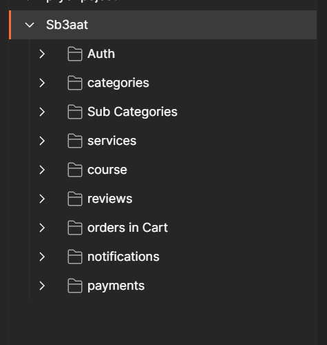
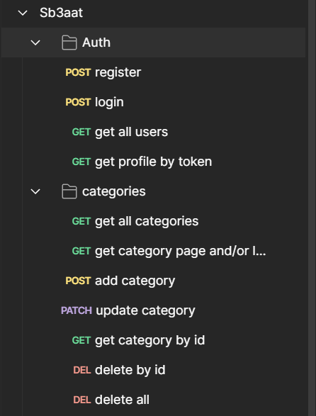
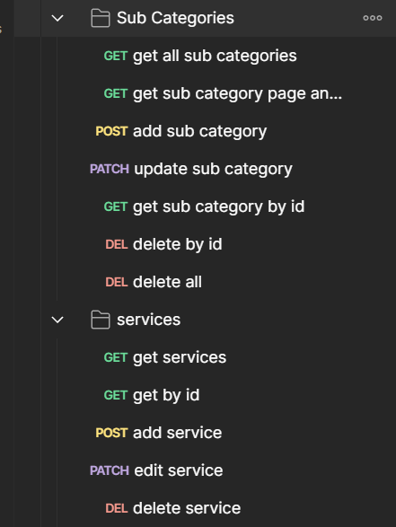
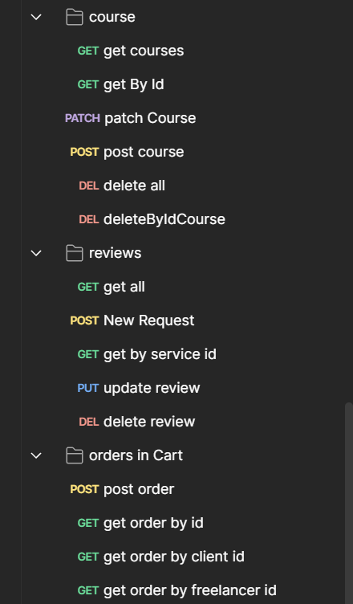
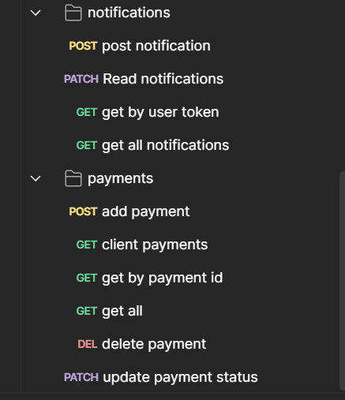

# Sb3aat Platform API Documentation

## Introduction

- Sb3aat Platform is a freelancing platform that connects clients with freelancers. It allows clients to order services and courses, and freelancers to offer their services and courses. The platform also supports payments, reviews, and notifications. The Sb3aat Platform API provides a set of endpoints for managing users, services, orders, payments, and more. It is designed to be used by the Sb3aat Platform web Application.

## Getting Started

- To get started with the Sb3aat Platform API
- clone the repository and install dependencies.
- Ensure Node.js is installed on your system.

## Installation

- Clone the repository: `git clone
- Install dependencies: `npm install`
- Start the server: `npm start`

## Usage

- The API can be accessed at `http://localhost:3000/api/` by default.

## Auth Routes

- **Register User:** POST `/api/auth/register` - Registers a new user in the system.
- **Login User:** POST `/api/auth/login` - Authenticates a user and returns a token.
- **Get All Users:** GET `/api/auth/Users` - Retrieves a list of all users.

## Categories Routes

- **Get All Categories:** GET `/api/categories/` - Retrieves all categories.
- **Add a New Category:** POST `/api/categories/` - Creates a new category.
- **Update Category:** PATCH `/api/categories/:id` - Updates an existing category by ID.
- **Delete Category:** DELETE `/api/categories/:id` - Deletes a category by ID.
- **Delete All Categories:** DELETE `/api/categories/` - Deletes all categories.

## Sub Categories API

- **Get All Sub Categories:** GET `/api/subCategories/` - Retrieves all subcategories.
- **Add a New Sub Category:** POST `/api/subCategories/` - Creates a new subcategory.
- **Update Sub Category:** PATCH `/api/subCategories/:id` - Updates an existing subcategory by ID.
- **Delete Sub Category:** DELETE `/api/subCategories/:id` - Deletes a subcategory by ID.
- **Delete All Sub Categories:** DELETE `/api/subCategories/` - Deletes all subcategories.

## Service Routes

- **List Services:** GET `/api/service/` - Retrieves a list of all available services.
- **Create Service:** POST `/api/service/` - Adds a new service.
- **Get Service Details:** GET `/api/service/:id` - Fetches details of a specific service.
- **Update Service:** PATCH `/api/service/:id` - Updates the information of an existing service.
- **Delete Service:** DELETE `/api/service/:id` - Removes a service from the listing.

## Courses Routes

- **Get All Courses:** GET `/api/courses/` - Retrieves all courses available.
- **Add New Course:** POST `/api/courses/` - Creates a new course.
- **Update Course:** PATCH `/api/courses/:id` - Updates details of a specific course.
- **Delete Course:** DELETE `/api/courses/:id` - Deletes a course.

## Orders Routes

- **Create Order:** POST `/api/orders/` - Places a new order.
- **View Order:** GET `/api/orders/:id` - Views details of a specific order.
- **Update Order:** PATCH `/api/orders/:id` - Updates an existing order.
- **Cancel Order:** DELETE `/api/orders/:id` - Cancels an order.

## Reviews Routes

- **Post Review:** POST `/api/reviews/` - Submits a review for a service or product.
- **Get Reviews:** GET `/api/reviews/` - Retrieves all reviews.
- **Delete Review:** DELETE `/api/reviews/:id` - Deletes a specific review.

## Notification Routes

- **Get Notifications:** GET `/api/notifications/` - Retrieves all notifications for a user.
- **Create Notification:** POST `/api/notifications/` - Sends a new notification to users.
- **Delete Notification:** DELETE `/api/notifications/:id` - Removes a specific notification.

## Payment Routes

- **Process Payment:** POST `/api/payments/` - Processes a payment transaction.
- **Get Payment Status:** GET `/api/payments/:id` - Checks the status of a payment.
- **Refund Payment:** PATCH `/api/payments/:id/refund` - Initiates a refund for a payment.

## Screenshots

### Overview of the API

### Auth Routes and Categories Routes

### Sub Categories API and Service Routes

### Courses Routes , Reviews Routes and Orders Routes

### Notification Routes and Payment Routes

## Technologies Overview

- **Node.js**: JavaScript server-side runtime.
- **Express**: Flexible Node.js framework.
- **MongoDB**: Scalable NoSQL database program.
- **Mongoose**: MongoDB data modeling library.
- **JWT**: Secure authorization token standard.
- **Bcrypt**: Robust password hashing function.
- **Morgan**: Node.js HTTP logger.
- **Nodemon**: Server auto-restart utility.

## Conclusion

The Sb3aat Platform API provides a set of endpoints for managing users, services, orders, payments, and more. It is designed to be used by the Sb3aat Platform web and mobile applications. The API is built using Node.js, Express, and MongoDB, and it is secured with JWT and Bcrypt. The API is well-documented and easy to use, making it a powerful tool for building the Sb3aat Platform ecosystem.
